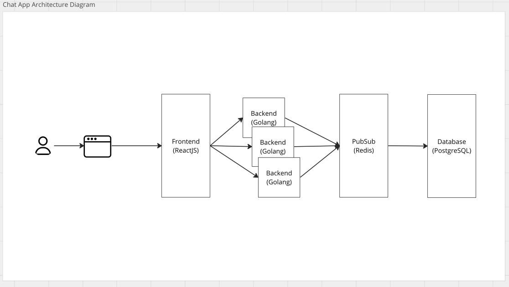

### Chat App

#### Tech Stack

- Golang
- Websocket
- Redis
- PostgreSQL
- Docker

#### Prerequisite

- Docker
- Run migration using `make migrateup`. (this needs the `docker-compose up` for postgresql)

#### Run application

1. Run Redis and PostgreSQL in docker using make `docker-compose up`
2. Change directory to server, `cd server`
3. Run `make run-air`

#### TODOS

- Finilize folder structure
- Finalize Private Chate
- Add Group Chat
- Add unit testing
- Add Frontend

#### Migrations
This commands are using docker to perform migration
- `make create-migration-file migration_name=CHANGE_THIS_WITH_MIGRATON_NAME` to create a migration files
- `make migrateup-docker` to run the migration file in docker
- `make migratedown-docker` delete migrations using docker

#### Architecture Diagram

